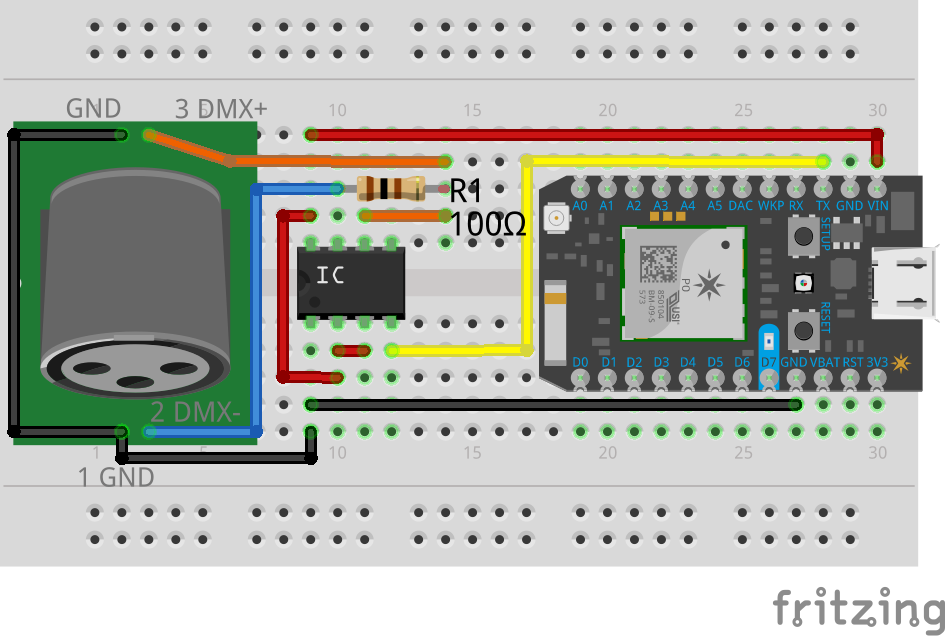

# SimpleDmx

A Particle library for sending DMX signals using high-level functions from the particle firmware API.

This work is likely not a good solution for professional DMX applications. 
It works for me with a small setup for ambient lightning.
I'm not a DMX expert. 
The implementation is very trivial and NOT optimized e.g. for performance.
Feel free to [contribute](#Contributing).


## Usage

### Hardware

Connect a RS-485 transceiver IC like (75176BP) to the `TX` pin of your particle device. 

A minimal example for quick tests with the photon:



You should decouple the dmx system for more robust applications. 
Schematics can be found at [www.mathertel.de](http://www.mathertel.de/Arduino/DMXShield.aspx).
 

### Software

Using the library is as simple as:

```
#include "SimpleDmx.h"
SimpleDmx simpleDmx;

void setup() {
  simpleDmx.start();
  simpleDmx.setChannel(0,255);
  // ...
}

void loop() {}
```

See the [examples](examples) folder for more details.


## Contributing

Here's how you can make changes to this library and eventually contribute those changes back.

To get started, [clone the library from GitHub to your local machine](https://help.github.com/articles/cloning-a-repository/).

Change the name of the library in `library.properties` to something different. You can add your name at then end.

Modify the sources in <src> and <examples> with the new behavior.

To compile an example, use `particle compile examples/usage` command in [Particle CLI](https://docs.particle.io/guide/tools-and-features/cli#update-your-device-remotely) or use our [Desktop IDE](https://docs.particle.io/guide/tools-and-features/dev/#compiling-code).

After your changes are done you can upload them with `particle library upload` or `Upload` command in the IDE. This will create a private (only visible by you) library that you can use in other projects. Do `particle library add SimpleDmx_myname` to add the library to a project on your machine or add the SimpleDmx_myname library to a project on the Web IDE or Desktop IDE.

At this point, you can create a [GitHub pull request](https://help.github.com/articles/about-pull-requests/) with your changes to the original library. 

If you wish to make your library public, use `particle library publish` or `Publish` command.


## LICENSE
Copyright 2017 André Hanak <impressum@a-hanak.de>

Licensed under the MIT license
